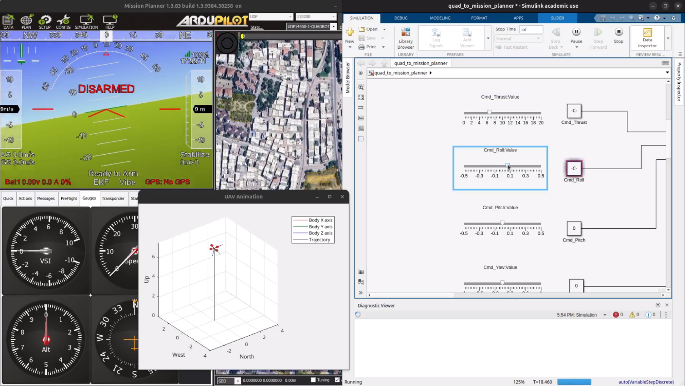
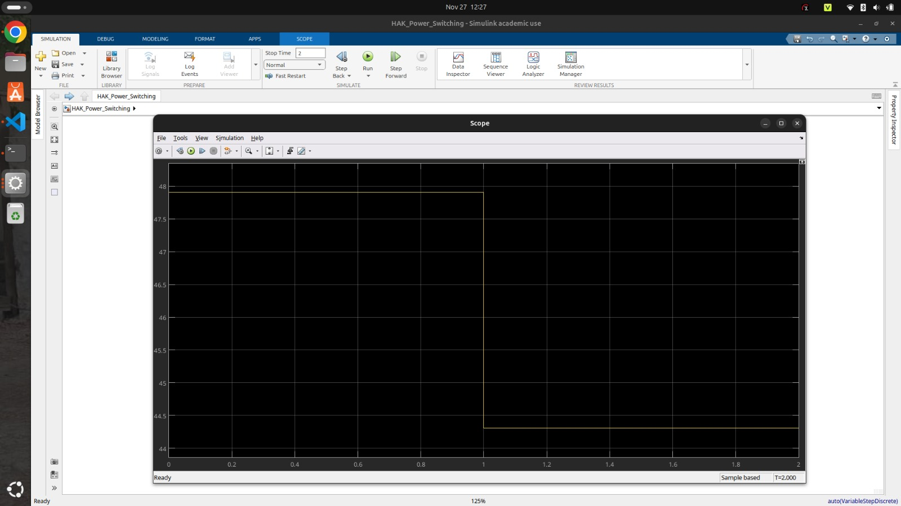
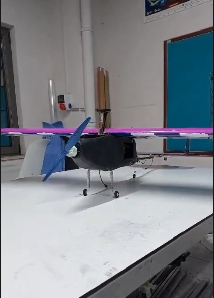
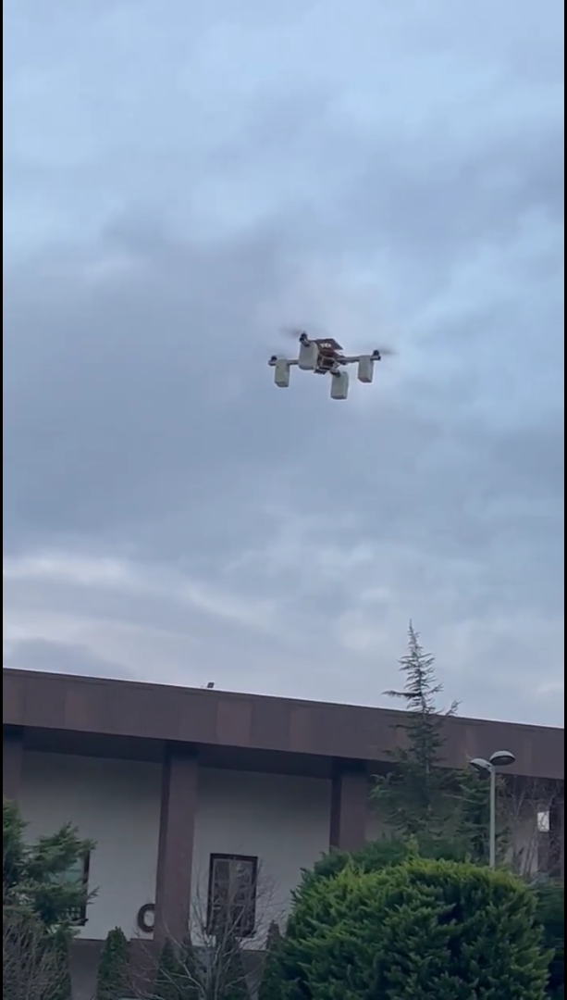

# Avionics & Autonomous Systems Engineer

> *"Never interrupt your enemy when he is making a mistake."* — Napoleon Bonaparte

Hi, I'm **Serdar Sökmen**. I am an Electrical-Electronics Engineering student and UAV Pilot dedicated to designing the next generation of autonomous flight systems. My work bridges the gap between theoretical control systems and real-world embedded applications.

[GitHub Profile](https://github.com/serdarskmnn) • [LinkedIn](https://www.linkedin.com/in/mserdarsokmen/) • [Contact Me](mailto:mserdarsokmen@gmail.com)

---

## 🏆 Featured Project: METU VTOL 2025
**Role:** Team Leader & Avionics Leader and Flight Control Algorithm Designer

Our team designed a **Tilt-Rotor VTOL UAV** capable of vertical takeoff and efficient forward flight. This project was selected as a **Finalist** in the prestigious METU VTOL Aircraft Competition 2025.

### 🛠️ Technical Highlights
* **Custom Flight Controller:** Developed using STM32 and C++.
* **Simulation:** Validated aerodynamics and transition logic in MATLAB/Simulink & Gazebo.
* **Autonomy:** Implemented mission planning and fail-safe protocols using ArduPilot.

> 

---

## 🧠 Simulation Lab
My personal R&D playground for testing advanced control theories before deployment.

### 1. 🚁 6-DOF Flight Control & Visual Servoing
A complete simulation environment where a drone autonomously tracks and follows a moving target using a downward-facing camera.
* **Tech:** MATLAB, Simulink, Computer Vision.
* **Result:** Successful tracking with real-time PID adjustments.

> 

### 2. ⚡ Hybrid Power Management System (HAK)
A critical safety system designed to switch power sources from Hydrogen Fuel Cell to Li-Po battery in under 5ms during failure.
* **Tech:** Simscape Electrical, Stateflow.
* **Result:** Verified seamless transition with zero voltage drop.

> 

---

## 🛠️ Hangar (Other Projects)
A collection of UAV platforms I have built and flown over the years.

### ✈️ Fixed Wing UAV (Long Endurance Survey)

### 🚁 Quadcopter UAV (Payload Test Platform)

### 🚀 VTOL UAV (Tilt-Rotor Prototype)

---

### 📺 Flight Test Archive
Detailed flight logs, PID tuning sessions, and raw VTOL transition videos are hosted on my cloud drive:

---

### 🎓 Certifications & Education
* **B.Sc. Electrical-Electronics Engineering** - Bursa Technical University (2023 - 2028)
* **UAV-1 Commercial Pilot License** - SHGM
* **MATLAB & Simulink Proficiency** - MathWorks File Exchange Contributor

---
© 2025 Serdar Sökmen. Powered by GitHub Pages.